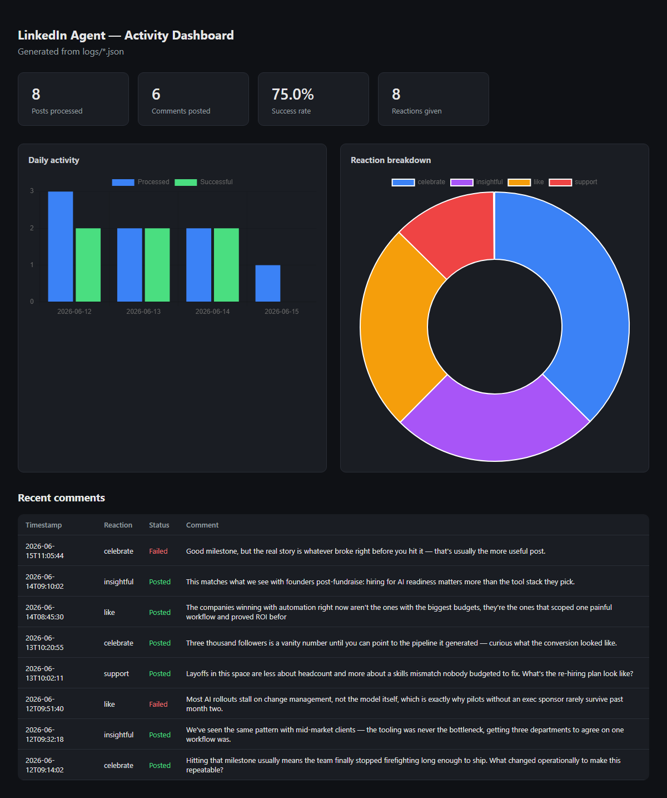

# LinkedIn Autonomous Commenter

An autonomous agent that logs into LinkedIn with a real Chrome session, reads
posts in the feed, picks a contextually appropriate reaction, and writes a
persona-consistent comment using an LLM — all paced to look like genuine human
engagement instead of a bot burst.

Built as the "Watcher" component of a [Personal AI Employee](#why-this-exists)
system: a lightweight script that handles one job end-to-end (LinkedIn
engagement) so a human founder doesn't have to do it manually every day.

## What it does

On a single manual run, the agent:

1. Opens LinkedIn using a saved session (no repeated logins)
2. Scans the feed and picks up to `MAX_POSTS` real, non-sponsored posts
3. For each post:
   - Reacts (Like / Celebrate / Support / Love / Insightful / Funny — chosen
     by scoring the post text against keyword sets, not random)
   - Generates a short, opinionated comment in a fixed persona's voice via an
     LLM, grounded in the actual post content
   - Posts the comment and **verifies** it actually appears in the post's
     DOM before counting it as a success
   - Waits a randomized 50–90s gap before moving to the next post
4. Logs every action (success/failure, reaction picked, comment text) to a
   dated JSON file, and records a fingerprint of each engaged post so the
   same post never gets engaged twice across separate runs

Nothing runs on a schedule — it's a manual, human-triggered run by design,
capped at a small number of posts per run.

## Why this exists

Staying visibly active on LinkedIn (reacting, commenting with real opinions)
is one of the highest-leverage, lowest-effort things a founder can do for
their personal brand — and one of the easiest to let slip. This project
turns "spend 20 minutes a day commenting thoughtfully on LinkedIn" into a
script that does the same thing, in the same voice, without the daily
willpower cost.

It also doubles as the LinkedIn "Watcher" for a broader Personal AI Employee
architecture (Claude Code as the reasoning engine, lightweight Python
watchers as the senses) — a pattern from the *Personal AI Employee Hackathon:
Building Autonomous FTEs* program this project started in.

## Architecture

```
 ┌──────────────┐   ┌───────────────────┐   ┌────────────────────┐
 │ Saved session │──▶│  Feed scanner      │──▶│  Reaction picker    │
 │ (cookies.json)│   │ (Comment-button    │   │ (keyword scoring →  │
 │               │   │  DOM walk, tags    │   │  Like/Celebrate/... │
 └──────────────┘   │  data-bot-id)      │   └─────────┬──────────┘
                     └───────────────────┘             │
                                                         ▼
 ┌────────────────────┐   ┌──────────────────┐   ┌─────────────────┐
 │ Dedup check          │◀──│ Persisted state   │   │ react_to_post()  │
 │ (post_fingerprint     │   │ logs/engaged.json│   │ clicks Like btn  │
 │  vs logs/engaged.json)│   └──────────────────┘   └─────────┬───────┘
 └────────────────────┘                                       │
                                                                ▼
                              ┌───────────────────┐   ┌──────────────────┐
                              │ comment_generator   │──▶│ click_and_comment│
                              │ (persona.md + Groq  │   │ types + submits  │
                              │  LLM → clean comment)│   │ + verifies DOM   │
                              └───────────────────┘   └─────────┬────────┘
                                                                  │
                                                                  ▼
                                                        ┌──────────────────┐
                                                        │ logs/YYYY-MM-DD   │
                                                        │ .json + human_gap │
                                                        └──────────────────┘
```

## Tech stack

| Layer | Choice | Why |
|---|---|---|
| Browser automation | Playwright (Python), real Chrome channel | Bundled Chromium is fingerprinted more easily than installed Chrome |
| Session persistence | Manual cookie JSON, not `launch_persistent_context` | Avoids Chrome profile-lock conflicts when the script runs alongside a normally-open browser |
| Bot detection evasion | Init script overriding `navigator.webdriver`, plugins, languages | Standard headless-detection probes LinkedIn (and most sites) run |
| Comment generation | Groq API (`llama-3.3-70b-versatile`) | Fast, free-tier, OpenAI-compatible — see [LLM backend](#llm-backend-claude-cli--groq-api) below |
| Persona | `persona.md` — plain-text style guide injected into the prompt | Keeps the "voice" editable without touching code |
| Persistence | Flat JSON files (`logs/`, `session/`) | No DB needed for a single-user, low-volume agent |

## Engineering challenges solved

This project went through several real, observed failures during development
— each one taught something about automating a frontend that actively
resists automation.

**1. LinkedIn's reaction button hides its name in `aria-label`, not visible text.**
The Like button's accessible name for Playwright's `get_by_role(name=...)`
isn't "Like" — it's `"Reaction button state: no reaction"`, because
`aria-label` overrides visible text for accessible-name computation. Every
`get_by_role(name=/^like$/i)` call silently matched nothing. Fixed by locating
the button via `button[aria-label^="Reaction button state"]` instead, then
verifying the label actually changed after the click (proof the reaction
registered, not just that a click didn't throw).

**2. The comment editor mounts outside the post's own DOM container.**
LinkedIn's comment box (a `tiptap`/ProseMirror rich-text editor) doesn't live
inside the post container that gets the `data-bot-id` tag — it mounts 2+
parent levels up. Scoping the input search, submit-button search, and
post-success verification to the original container meant all three silently
failed once the editor changed. Fixed by walking up from the tagged container
(up to 8 levels) to find the actual ancestor that contains the editor, and
re-scoping every later lookup to that wider ancestor (`data-bot-scope`)
instead of the original `data-bot-id`.

**3. Cross-post contamination from page-wide selectors.**
An early version queried for the comment input with a page-wide selector.
LinkedIn keeps every previously-opened comment editor in the DOM, so after
processing post 1, a "page-wide" query for *any* open editor kept returning
post 1's stale editor — the script logged success on every post while
LinkedIn showed comments on none of them. Every DOM query in this project is
now scoped to the specific post's tagged container, and every "success" is
verified by checking the post's actual `innerText` contains the comment
before it's counted.

**4. Pacing that only fired after success looked like a bot.**
The inter-post delay originally only ran after a comment posted successfully.
When comment generation was failing upstream (see #5), reactions fired back
to back with no gap — the fastest way to get flagged for automated behavior.
Fixed by extracting a single `human_gap()` call that runs after *every*
post-processing attempt — success, failure, or skip — so the pacing is
constant regardless of what happened upstream.

**5. LLM backend swap: local CLI subprocess → hosted API.**
Comment generation originally shelled out to the local `claude.cmd` CLI via
`subprocess`. Running that from inside an already-running Claude Code session
caused session contention — intermittent `(code 0)` failures and garbled,
half-written text getting posted as the actual LinkedIn comment. Replaced
with a direct Groq API call (OpenAI-compatible chat completions), called
through a `ThreadPoolExecutor` so the synchronous SDK doesn't block the
asyncio event loop. Output still passes through a validator (`extract_comment`)
that rejects clarifying questions, sentence fragments, and AI meta-commentary
before anything is allowed to post — a raw LLM response is never trusted
directly.

**6. Cross-run duplicate engagement.**
Posts are identified during a scan by a `data-bot-id` assigned from scroll
position — it resets every run, so it can't tell "the same real post" apart
across two separate sessions. Fixed with a content-based fingerprint
(`post_fingerprint`): a SHA-256 hash of the cleaned post text with dynamic
social-proof lines ("X commented", "Suggested", "X likes this") stripped out
first, since those lines change between scans of the same post and would
otherwise make identical posts hash differently. Engaged fingerprints persist
in `logs/engaged.json` so a second run the same day won't re-react to (and
risk un-reacting) or re-comment on a post already handled.

**7. Real clicks blocked by a transient overlay Playwright never recovers from.**
`Locator.click()`/`.hover()` on the reaction button and the comment input
started failing mid-run with `<html>... intercepts pointer events`, retrying
for the full 30s timeout every time — a LinkedIn tooltip/loading-spinner
portal (rendered via floating-ui) sat on top of the target and never cleared,
so every later post in the same run kept failing the same way too. Playwright
clicks do real coordinate-based hit-testing, so an overlapping element wins
regardless of how long you wait. Fixed by dispatching the click (and hover,
via `mouseover`/`mouseenter`) directly on the element through `page.evaluate`
instead — the same bypass already used for the comment-open and submit
buttons — since a JS-invoked `.click()` fires the element's own handler
without any hit-test, immune to whatever LinkedIn renders on top of it.

## Setup

```bash
setup.bat          # installs deps, installs Playwright's Chromium, creates .env
# edit .env and paste your Groq API key
run.bat             # first run: log into LinkedIn manually when the browser opens
```

Session cookies are saved after the first successful login — subsequent runs
skip the login step entirely.

Prefer a browser UI over the terminal? `dashboard.bat` starts a local control
panel at `http://127.0.0.1:5000` — see [Dashboard](#dashboard) below.

## Configuration (`.env`)

| Key | Default | Meaning |
|---|---|---|
| `GROQ_API_KEY` | — | Required. Free tier at console.groq.com |
| `MAX_POSTS` | `5` | Posts to react+comment on per run |
| `MIN_GAP_SECONDS` / `MAX_GAP_SECONDS` | `50` / `90` | Randomized delay between posts |
| `HEADLESS` | `false` | Run Chrome without a visible window |
| `MAX_POST_AGE_HOURS` | `12` | Skip posts older than this — no benefit reacting/commenting on a post the feed algorithm has stopped surfacing |
| `ENGAGE_AS_PAGE` | `Cybrum Solutions` | Used only by `linkedin_watcher_cybrum.py` — Page name to engage as |

## Engaging as a Page instead of your personal profile

```bash
python linkedin_watcher_cybrum.py
```

A second entry point that reuses every bit of `linkedin_watcher.py`'s scan/
react/comment logic (so any future DOM fix lands in both at once — see
[Engineering challenges solved](#engineering-challenges-solved)) but drives
LinkedIn's own **"Comment, react, and repost as"** picker (the small identity
switcher next to a post's like count) to switch engagement to a Page you
admin (`ENGAGE_AS_PAGE` in `.env`, default `Cybrum Solutions`). The switch
runs **per post**, right before each react/comment — LinkedIn stores that
identity as per-post state, not session-wide. If the switch can't be
*verified* on a post (the switcher avatar must visibly change), that post is
skipped instead of risking a comment going out under the wrong identity.

It writes to `logs/cybrum/` with its own `engaged.json`, so its dedup history
never mixes with the personal watcher's — the same post can legitimately get
a personal reply from you *and* an official reply from the company, tracked
independently. It also uses a separate `persona_cybrum.md` — a company "we"
voice instead of the personal CEO "I" voice — instead of `persona.md`.

## X (Twitter) agent

```bash
python x_watcher.py
```

The same idea pointed at X's home timeline: scan tweets, skip ads and
anything already engaged, **like + short reply** on relevant ones (same
relevance filter as LinkedIn), with the same 50–90s human pacing. It shares
the Groq comment generator (via a `platform` parameter so the prompt says
"X post", with a separate `persona_x.md` builder voice and a 280-character
guard) but is otherwise its own Playwright script, because X's DOM plays by
different rules than LinkedIn's:

- **Stable selectors for free.** X ships `data-testid` on everything
  (`tweet`, `tweetText`, `like`/`unlike`, `reply`, `tweetTextarea_0`,
  `tweetButton`) and every tweet has a permanent `/status/<id>` link — so
  the tweet ID is the dedup key and there's no need for LinkedIn-style
  content fingerprinting or `data-bot-id` tagging.
- **Virtualized timeline.** X removes off-screen tweets from the DOM as you
  scroll, so the watcher never holds an element reference across a scroll —
  every action re-finds its tweet by status ID (`article:has(a[href*=
  "/status/<id>"])`) first.
- **Verification-first, as always**: a like only counts when the button
  flips to `unlike`; a reply only counts when the composer modal actually
  closes after Post. A failed reply gets its draft discarded (Escape +
  confirm) rather than left blocking the page.

The session lives in `session/x_profile/` — a dedicated persistent Chrome
profile, not a cookies file. First run: log in once in the opened window
(same one-time flow as LinkedIn); after that the profile keeps you logged
in. A persistent profile is also what makes the login *work*: X's anti-bot
traps ephemeral automated contexts in an endless phone-verification step,
but a real on-disk profile looks like a real browser. Logs and dedup live
in `logs/x/`.

If the login still won't complete, `python x_login_import.py` is the
fallback: log in to x.com in your normal everyday Chrome, copy the
`auth_token` cookie from DevTools (Application → Cookies → x.com), paste it
into the prompt — the watcher folds it into the profile on next run.

## Dashboard

```bash
dashboard.bat        # or: python app.py
```

A local Flask control panel at `http://127.0.0.1:5000` — binds to localhost
only, no auth, single-user by design. It replaces running `run.bat` /
`python linkedin_watcher_cybrum.py` from a terminal:

- **Run / Stop buttons** for each agent (Personal Profile, Cybrum Solutions
  Page, X), with a per-run "posts this run" override (passed to the
  subprocess as `MAX_POSTS`, doesn't touch `.env`).
- **Live console** streaming the agent's stdout in real time. When launched
  from the dashboard the agents skip their end-of-run "press Enter to close"
  prompt entirely (it only makes sense in a terminal) and close the browser
  on their own. The one-time first-login prompt is *not* skipped — the
  dashboard shows an **"I've logged in — continue"** button once it detects
  that prompt, so the run only proceeds after you've actually completed the
  login in the visible Chrome window.
- **Activity charts** (daily volume, reaction breakdown) and a recent-comments
  table, aggregating all agents' `logs/` directories — same data
  `generate_dashboard.py` reads, just live instead of a static export.

Only one agent runs at a time — the LinkedIn agents share one browser
session, and running a second automated browser in parallel is more bot
footprint than this project wants anyway.

`python generate_dashboard.py` still works standalone if you just want a
static, shareable `dashboard.html` snapshot (gitignored, since it embeds real
post previews and comment text):



## Persona

`persona.md` defines the voice — currently an "AI Solutions Expert / CEO &
Founder" persona with explicit style rules (1-3 sentences, no hashtags, no
sycophantic openers, must add one specific insight). It's plain text, so the
persona can be swapped without touching code. `generate_comment()` takes the
persona file path as an argument (default `persona.md`) — that's how
`linkedin_watcher_cybrum.py` swaps in `persona_cybrum.md`'s company "we"
voice without forking any code.

Comment length varies per post instead of always maxing out at 3 sentences:
`_pick_comment_length()` in `comment_generator.py` picks "short" (one
punchy sentence) or "medium" (2-3 sentences) before generating, weighted by
the post's own length, with some randomness mixed in so the same kind of
post doesn't always get the same length comment.

## Tests

```bash
pip install -r requirements-dev.txt
pytest -q
```

Covers the pure logic that's safe to unit test without a browser or live API
calls: comment extraction/validation (`comment_generator.py`) and post
cleaning/reaction-picking/fingerprinting (`linkedin_watcher.py`).

## Demo video

<video src="demo/agent_demo.webm" controls width="700"></video>

Recorded against a local mock feed, not real LinkedIn — same production
decision logic (reaction picking, relevance filtering, real Groq-generated
comments, DOM verification), zero real account involvement, zero third-party
data, zero ToS exposure.

## Responsible-use notes

- Manual trigger only, capped at a small post count per run — no scheduler,
  by design.
- Every action is paced and logged; nothing posts without a DOM-level
  verification that it actually landed.
- This automates engagement on a platform whose Terms of Service restrict
  scripted activity. It was built as a personal productivity experiment and
  portfolio piece, not a product — use on your own account, at your own
  discretion and risk.

## Relevance filter

Before generating a comment, the post is checked against a deliberately broad
keyword set (`RELEVANCE_KEYWORDS` in `linkedin_watcher.py`) spanning AI/automation,
business growth, future of work, and general celebration/achievement posts
(milestones, promotions, launches — engaging with those is normal LinkedIn
behavior regardless of topic). If nothing matches, the agent still reacts but
skips the comment — saving an LLM call and avoiding off-topic comments under
the persona's name, like the React-testing-course post that got an AI-persona
comment before this filter existed.

## Feed scanning

The agent scans the algorithmic home feed only — no hashtag targeting.
LinkedIn's home feed already weights toward posts from your own network, so
it naturally lines up with the connection-degree priority below, without the
risk of a niche hashtag (e.g. a low-volume tag) returning too few posts to
work with.

Each post's header timestamp is parsed (from the raw DOM text, before UI
noise gets stripped) and anything older than `MAX_POST_AGE_HOURS` (default
12) is skipped entirely — no reaction, no comment — since engaging with a
post the algorithm has stopped surfacing has no visibility upside.

Within each newly-revealed batch of posts, the connection-degree badge
(1st/2nd/3rd, or "Suggested"/company-page posts with no badge) is parsed and
the batch is sorted so 1st-degree connections are tackled first, then
2nd-degree, then everyone else — engaging with people in your network first
tends to be more valuable than cold 3rd-degree/suggested posts.

At the end of a run, a one-line summary (`scanned`, `sponsored`, `too-old`,
`too-short`, `dedup`, `engaged`) prints so you can tell whether the feed
genuinely had few posts to work with, or whether everything available got
filtered out.

A plain `scrollBy(900)` sometimes doesn't trigger LinkedIn's lazy-load (one
tall post can easily be taller than 900px, leaving the next scroll looking
at the same content). Each scroll that reveals zero new posts counts as
"stagnant" — the next attempt jumps straight to the bottom of the page and
waits longer, giving LinkedIn more room to load more. After 4 stagnant
scrolls in a row, the scan ends early instead of grinding through the full
scroll budget for no benefit.

## What's next

- A feedback loop that revisits posted comments later to track which ones
  got engagement, closing the loop on "what actually works"
